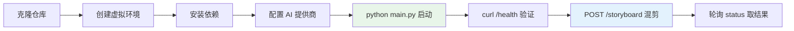
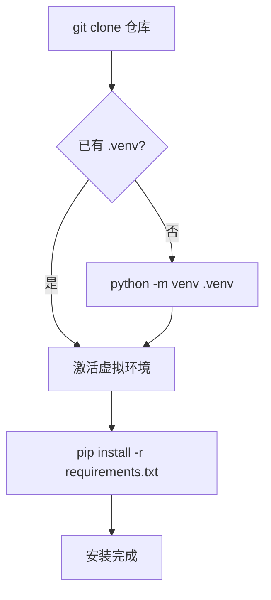
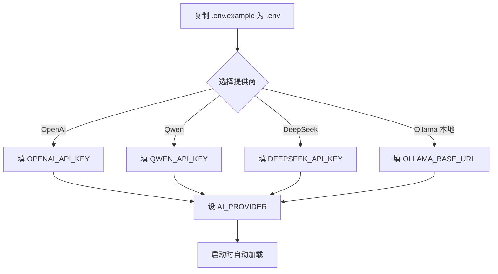
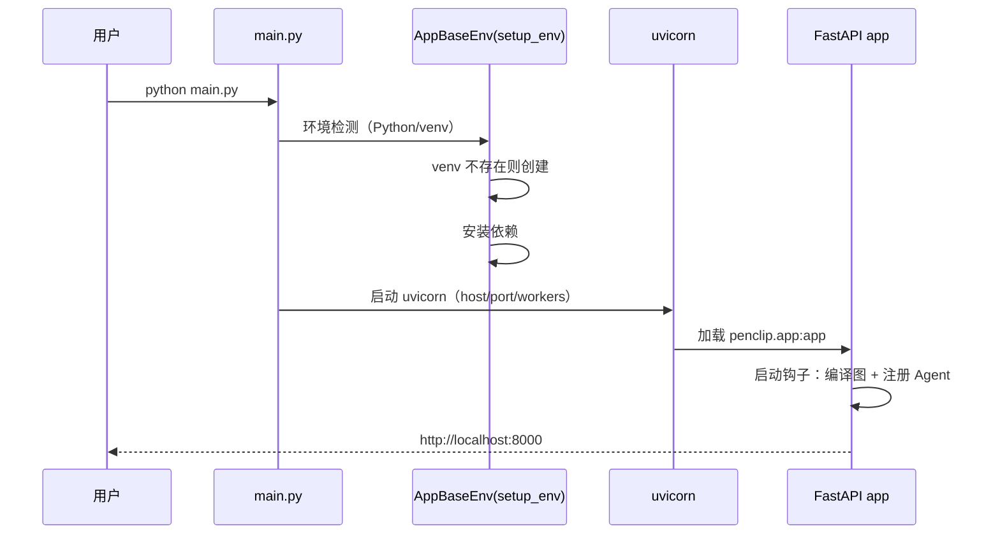
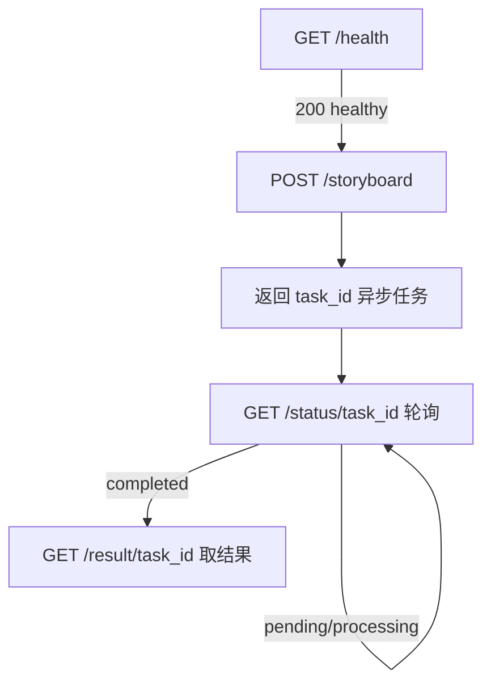
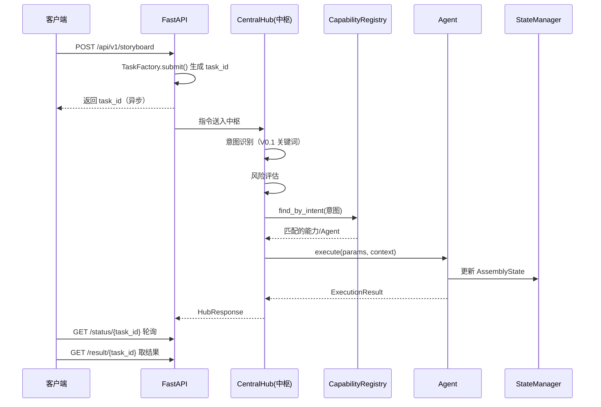
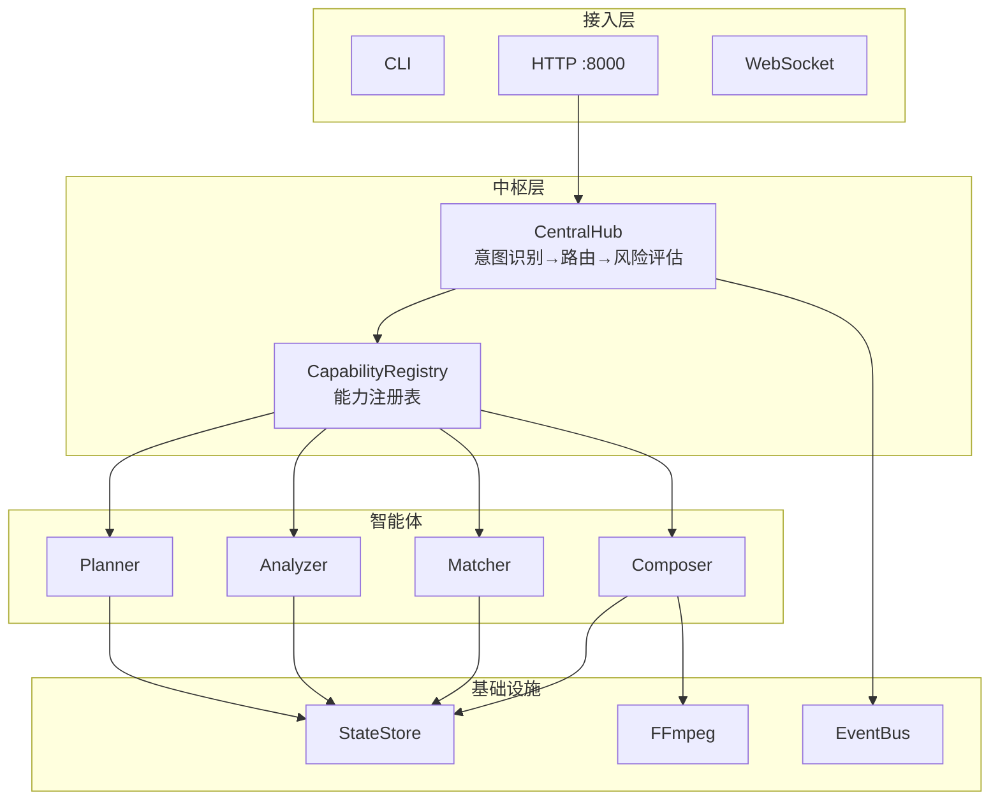

# PenClip 快速开始

> 用最少步骤让服务跑起来并发起第一次视频混剪请求。全程约 5 分钟。

## 1. 总览



## 2. 环境要求

| 依赖 | 版本/说明 | 必需 |
| :-- | :-- | :-- |
| Python | 3.9+ | ✅ |
| FFmpeg | 配置到 PATH，或由项目自动检测/内置 | ✅ |
| 磁盘 | 足够空间存视频与输出（默认 `data/output/`） | ✅ |
| AI 提供商 | OpenAI / Qwen / DeepSeek / Ollama 任一 | 视功能而定 |

> `python main.py` 会自动检测并创建虚拟环境、安装依赖，环境准备大部分可省略手动步骤。

## 3. 安装



```bash
git clone https://github.com/neopen/video-clip-agent.git
cd video-clip-agent

# Windows
python -m venv .venv && .venv\Scripts\activate.bat
# Linux / macOS
python -m venv .venv && source .venv/bin/activate

# 安装依赖（开发环境用：pip install -e ".[dev]"）
pip install -r requirements.txt
```

## 4. 配置 AI 提供商



```bash
cp .env.example .env
```

编辑 `.env`，取消注释并填写所选提供商：

```ini
# 提供商: openai | qwen | deepseek | ollama
AI_PROVIDER=qwen

QWEN_API_KEY=sk-xxxxxxxxxxxxxxxxxxxxxxxxxxx
QWEN_BASE_URL=https://dashscope.aliyuncs.com/compatible-mode/v1
QWEN_MODEL=qwen-plus
```

| 提供商 | 环境变量 |
| :-- | :-- |
| OpenAI | `OPENAI_API_KEY` / `OPENAI_BASE_URL` / `OPENAI_MODEL` |
| Qwen | `QWEN_API_KEY` / `QWEN_BASE_URL` / `QWEN_MODEL` |
| DeepSeek | `DEEPSEEK_API_KEY` / `DEEPSEEK_BASE_URL` / `DEEPSEEK_MODEL` |
| Ollama | `OLLAMA_BASE_URL`（默认 `http://localhost:11434`）/ `OLLAMA_MODEL` |

> 配置采用双通道：`config.json`（用户本地覆盖）+ `.env`（环境变量，优先级更高）。

## 5. 启动服务



```bash
python main.py                          # 默认 0.0.0.0:8000
python main.py --port 8080              # 自定义端口
python main.py --host 0.0.0.0 --port 8000  # 生产（多进程需 Redis）
```

启动成功后：

- API 文档：http://localhost:8000/docs
- ReDoc：http://localhost:8000/redoc

> 热重载（reload）与多进程（workers>1）互斥，同时启用时强制 workers=1。

## 6. 验证



```bash
# 1. 健康检查
curl http://localhost:8000/health

# 2. 发起一次混剪（异步）
curl -X POST http://localhost:8000/api/v1/storyboard \
  -H "Content-Type: application/json" \
  -d '{"script": "将视频中笑的部分剪成欢快的集锦", "language": "zh"}'
# → {"task_id": "...", "status": "pending"}

# 3. 轮询任务状态
curl http://localhost:8000/api/v1/status/{task_id}

# 4. 获取结果
curl http://localhost:8000/api/v1/result/{task_id}
```

## 7. 一次完整调用时序



## 8. 架构速览



## 9. 常见问题

| 问题 | 处理 |
| :-- | :-- |
| 端口被占用 | `python main.py --port 8080` 换端口 |
| FFmpeg 未找到 | 安装 FFmpeg 并加入 PATH，或配置内置 FFmpeg 路径 |
| 多进程下任务状态分裂 | 多进程模式需 Redis（配置 `REDIS_URL`），否则任务在进程间不可见 |
| 换了 provider 不生效 | 确认 `.env` 中 `AI_PROVIDER` 与对应 `*_API_KEY` 都已填写并取消注释 |
| 想直接看接口 | 访问 http://localhost:8000/docs |

---

相关文档：[项目总结](视频混剪智能体-项目总结.md) · [技术架构](视频混剪智能体-技术架构.md) · [设计原则](视频混剪智能体-设计原则.md) · [版本演进](视频混剪智能体-版本演进.md)